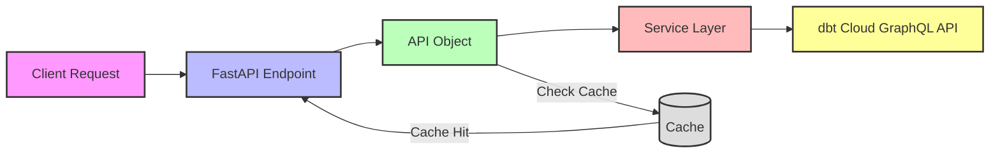

## **FastAPI Endpoint Implementation and Higher Level Abstraction Layer**

The existing project provides a foundation for interacting with the dbt Cloud API and provides a set of services for working with dbt Cloud resources. 
The discoveryAPI interface currently provides 2 levels of abstraction, the first (service layer) and the second (api layer). 
The service layer provides a low-level interface to the dbt Cloud GraphQL API through API, while the api layer provides a higher-level interface to the service layer.

We will be adding a third (client layer) that will provide a higher-level interface on top of the API layer with more user-friendly types and methods. This will be exposed as a REST API as well as an AI Agent Toolset.


## **Overview**

Create a new API layer that replaces the previous implementation while maintaining compatibility with the existing service layer (ModelService, JobService). The solution enhances the architecture with
- A comprehensive object hierarchy (dbtAccount -> Project -> Model/Job -> Run)
- User-friendly filtering mechanisms
- Built-in caching strategy for improved performance

This service runs as a FastAPI application that exposes both a REST API and an AI Agent Toolset, while continuing to utilize the existing low-level service implementations for dbt Cloud API interactions

The API is designed to efficiently handle common dbt reporting needs such as:
- Finding slowest models across projects
- Identifying longest-running jobs
- Filtering models by tags, materialization, or runtime
- Retrieving historical performance metrics
- Optimizing query performance through intelligent caching


## **Project Structure and Architecture**

### **Directory Structure**

```
src/discovery_api/
├── models/                             # Pydantic models
│   ├── __init__.py
│   ├── base.py                         # Base/common models (RuntimeReport, RunStatus)
│   ├── filters.py                      # Filter models (SearchFilter, ModelFilter, ProjectFilter)
│   └── resources.py                    # Resource models (Model, Job, Project, Run)
├── services/                           # Existing service layer implementations
│   ├── __init__.py
│   ├── BaseQuery.py                    # Base GraphQL query functionality
│   ├── EnvironmentService.py           # Environment-related services
│   ├── JobService.py                   # Job-related services
│   └── ModelService.py                 # Model-related services
├── cache/                              # Caching implementation
│   ├── __init__.py
│   └── strategy.py                     # CachingStrategy implementation
├── api/                             # New API layer
│   ├── __init__.py                     # Public exports
│   ├── dbt_account.py                  # dbtAccount implementation
│   ├── resources/                      # Resource classes
│   │   ├── __init__.py
│   │   ├── project.py                  # Project implementation
│   │   ├── model.py                    # Model implementation
│   │   ├── job.py                      # Job implementation
│   │   └── run.py                      # Run implementation
│   └── endpoints/                      # FastAPI endpoints
│       ├── __init__.py
│       ├── projects.py                 # Project endpoints
│       ├── models.py                   # Model endpoints
│       ├── jobs.py                     # Job endpoints
│       ├── runs.py                     # Run endpoints
│       └── account.py                  # Account-level endpoints
└── exceptions.py                       # Custom exception types
```

### **Core Architecture**

1. **Multi-Layered Architecture**
    - **Service Layer**: Existing low-level services that interact directly with dbt Cloud GraphQL API
    - **API Layer**: New object-oriented API providing logical organization and caching
    - **REST Endpoint Layer**: FastAPI endpoints exposing API resources as RESTful services

2. **Data Flow**



The system first checks the cache before making service calls. If data is found in cache and is still valid (based on TTL), it returns the cached response. Otherwise, it fetches fresh data from the service layer.

3. **Key Principles**
    - **Object Hierarchy**: Clear parent-child relationships (dbtAccount → Project → Model/Job → Run)
    - **Consistent Filtering**: Standardized filtering mechanisms across all resource types
    - **Performance First**: Integrated caching with appropriate TTL and invalidation strategies
    - **Batched Operations**: Optimized query strategies for multi-entity operations
    - **Clear Interfaces**: Well-defined method signatures with proper type hints

The architecture focuses on providing an intuitive interface while ensuring optimal performance through strategic caching. Each object maintains its own cache with TTL-based expiration, and all data access methods support explicit refresh when needed.

## **Implementation Phases**

### **Phase 1: Core Models and Caching Infrastructure**

#### Starting Context
```aider
/read-only src/discovery_api/services/
/read-only src/discovery_api/models.py
```

#### Ending Context
```aider
/add src/discovery_api/models/base.py
/add src/discovery_api/models/filters.py
/add src/discovery_api/cache/strategy.py
```

1. **Base Models**

```python
# src/discovery_api/models/base.py
"""Base models for the dbt Discovery API"""

import enum
from datetime import datetime
from typing import Optional, List
from pydantic import BaseModel

class RuntimeReport(BaseModel):
    job_id: str
    run_id: str
    model_id: Optional[str]
    runtime: float
    start_time: datetime
    end_time: datetime

class RunStatus(str, enum.Enum):
    success = "success"
    failure = "failure"
    cancelled = "cancelled" 
    run_completed_at: datetime
```

2. **Filter Models**

```python
# src/discovery_api/models/filters.py
"""Filter models for query filtering"""

from typing import Optional, List, Dict, Any, ForwardRef

# Forward references for type hints
Model = ForwardRef('Model')
Project = ForwardRef('Project')

class SearchFilter:
    """Base filter for searching across resources"""
    tags: Optional[List[str]]
    materialization: Optional[str]
    min_runtime: Optional[float]
    max_runtime: Optional[float]
    
    def __hash__(self) -> int:
        """Make filter hashable for cache key generation"""
        filter_tuple = (
            tuple(sorted(self.tags)) if self.tags else None,
            self.materialization,
            self.min_runtime,
            self.max_runtime
        )
        return hash(filter_tuple)

class ModelFilter(SearchFilter):
    """Filter specific to models"""
    models: Optional[List[Model]] 
    model_ids: Optional[List[str]] 

class ProjectFilter(SearchFilter):
    """Filter specific to projects"""
    projects: Optional[List[Project]]
    project_ids: Optional[List[str]]
    include_or_exclude: Optional[str] = "include"
```

3. **Caching Strategy**

```python
# src/discovery_api/cache/strategy.py
"""Caching strategy for the dbt Discovery API"""

import time
from typing import Dict, Optional, Any

class CachingStrategy:
    """Controls caching behavior across the API"""
    
    def __init__(self, cache_ttl: int = 300, enable_caching: bool = True):
        """Initialize the caching strategy
        
        Args:
            cache_ttl: Time to live for cache entries in seconds (default: 5 minutes)
            enable_caching: Whether caching is enabled globally
        """
        self.cache_ttl = cache_ttl
        self.enable_caching = enable_caching
        self.cache_timestamps: Dict[str, float] = {}
    
    def should_refresh(self, cache_key: str) -> bool:
        """Check if a cache entry should be refreshed based on TTL"""
        if not self.enable_caching:
            return True
            
        timestamp = self.cache_timestamps.get(cache_key)
        if timestamp is None:
            return True
            
        current_time = time.time()
        return (current_time - timestamp) > self.cache_ttl
    
    def update_timestamp(self, cache_key: str) -> None:
        """Update the timestamp for a cache entry"""
        self.cache_timestamps[cache_key] = time.time()
        
    def invalidate_cache(self, scope: str = "all") -> None:
        """Invalidate cache entries by scope
        
        Args:
            scope: Scope of invalidation ("all", "models", "jobs", "runs")
        """
        if scope == "all":
            self.cache_timestamps.clear()
        else:
            # Remove timestamps matching the scope prefix
            keys_to_remove = [k for k in self.cache_timestamps if k.startswith(f"{scope}_")]
            for key in keys_to_remove:
                del self.cache_timestamps[key]
```

### **Phase 2: Core Resource Classes Implementation**

#### Starting Context
```aider
/read-only src/discovery_api/models/base.py (existing)
/read-only src/discovery_api/models/filters.py (existing)
/read-only src/discovery_api/cache/strategy.py (existing)
```

#### Ending Context
```aider
/add src/discovery_api/api_v2/resources/model.py (new)
/add src/discovery_api/api_v2/resources/job.py (new)
/add src/discovery_api/api_v2/resources/run.py (new)
/add src/discovery_api/api_v2/resources/project.py (new)
```


1. **Model Implementation**

```python
# src/discovery_api/api_v2/resources/model.py
"""Model resource implementation"""

from typing import List, Optional, Dict
from datetime import datetime

from src.discovery_api.models.base import RunStatus
from src.discovery_api.models.filters import SearchFilter
from src.discovery_api.cache.strategy import CachingStrategy

class Model:
    """Represents a dbt model with properties"""
    
    def __init__(self, model_name: str, project_name: str, caching_strategy: Optional[CachingStrategy] = None):
        """Initialize a model
        
        Args:
            model_name: Name of the model
            project_name: Name of the project the model belongs to
            caching_strategy: Optional caching strategy to use
        """
        self.model_id = f"{project_name}.{model_name}"
        self._runs_cache: Dict[int, List['Run']] = {}
        self._sql_cache: Optional[str] = None
        self._jobs_cache: Optional[List['Job']] = None
        self.caching_strategy = caching_strategy or CachingStrategy()
```

### **Phase 3: Account and Project Implementation**

#### Starting Context
```aider
/read-only src/discovery_api/api_v2/resources/ (existing)
/read-only src/discovery_api/cache/strategy.py (existing)
```

#### Ending Context
```aider
/add src/discovery_api/api_v2/dbt_account.py (new)
```

1. **dbtAccount Implementation**

```python
# src/discovery_api/api_v2/dbt_account.py
"""dbtAccount implementation as the main entry point for the API"""

from typing import List, Optional, Dict

from src.discovery_api.models.filters import SearchFilter, ProjectFilter, ModelFilter
from src.discovery_api.cache.strategy import CachingStrategy
from src.discovery_api.api_v2.resources.project import Project
from src.discovery_api.api_v2.resources.model import Model
from src.discovery_api.api_v2.resources.job import Job
from src.discovery_api.api_v2.resources.run import Run

class dbtAccount:
    """Main entry point for the dbt Discovery API"""
    
    def __init__(self, token: str, caching_strategy: Optional[CachingStrategy] = None):
        """Initialize a dbt account
        
        Args:
            token: Authentication token for the dbt Cloud API
            caching_strategy: Optional caching strategy to use
        """
        self.token = token
        self.caching_strategy = caching_strategy or CachingStrategy()
        self._projects_cache: Optional[List[Project]] = None
```

### **Phase 4: FastAPI Endpoints**

#### Starting Context
```aider
/read-only src/discovery_api/api_v2/ (existing)
```

#### Ending Context
```aider
/add src/discovery_api/api_v2/endpoints/projects.py (new)
/add src/discovery_api/api_v2/endpoints/models.py (new)
/add src/discovery_api/api_v2/endpoints/jobs.py (new)
/add src/discovery_api/api_v2/endpoints/runs.py (new)
/add src/discovery_api/api_v2/endpoints/account.py (new)
/add src/discovery_api/main.py (new)
```

1. **Projects Endpoints**

```python
# src/discovery_api/api_v2/endpoints/projects.py
"""FastAPI endpoints for projects"""

from fastapi import APIRouter, Depends, Query
from typing import List, Optional

from src.discovery_api.api_v2.dbt_account import dbtAccount
from src.discovery_api.models.filters import ProjectFilter

router = APIRouter(prefix="/projects", tags=["projects"])

@router.get("/")
async def get_projects(account: dbtAccount = Depends(), refresh: bool = False):
    """Get all projects"""
    return account.get_projects(refresh=refresh)

@router.get("/{project_id}")
async def get_project(project_id: str, account: dbtAccount = Depends(), refresh: bool = False):
    """Get a specific project"""
    projects = account.get_projects(refresh=refresh)
    for project in projects:
        if project.project_id == project_id:
            return project
    return {"error": "Project not found"}
```

2. **Main FastAPI Application**

```python
# src/discovery_api/main.py
"""Main FastAPI application"""

import os
import logging
from fastapi import FastAPI, Depends

from src.discovery_api.api_v2.dbt_account import dbtAccount
from src.discovery_api.api_v2.endpoints import projects, models, jobs, runs, account
from src.discovery_api.cache.strategy import CachingStrategy

# Configure logging based on environment variable
log_level = os.environ.get("DBT_DISCOVERY_LOG_LEVEL", "WARNING")
logging.basicConfig(level=getattr(logging, log_level))
logger = logging.getLogger(__name__)

app = FastAPI(title="dbt Discovery API", description="API for interacting with dbt Cloud resources")

# Add routers
app.include_router(projects.router)
app.include_router(models.router)
app.include_router(jobs.router)
app.include_router(runs.router)
app.include_router(account.router)

# Dependency for getting the dbtAccount
def get_dbt_account():
    token = os.environ.get("DBT_SERVICE_TOKEN")
    if not token:
        raise ValueError("DBT_SERVICE_TOKEN environment variable not set")
    return dbtAccount(token=token, caching_strategy=CachingStrategy())

@app.get("/")
async def root():
    return {"message": "Welcome to dbt Discovery API"}
```

## **Dependencies**

```
# requirements.txt
fastapi>=0.101.0       # Modern, high-performance web framework
uvicorn>=0.23.0        # ASGI server for FastAPI
pydantic>=2.1.1        # Data validation and settings management
python-dotenv>=1.0.0   # Environment variable management
requests>=2.31.0       # HTTP client for API calls
typingdict>=0.0.1      # Type-hinted dictionary subclass
python-dateutil>=2.8.2 # Date utilities
gql-query-builder>=0.1.0 # GraphQL query builder
redis>=4.6.0           # Optional for external caching (future enhancement)
```

## **Configuration**

```
# .env.example
# Required configurations
DBT_SERVICE_TOKEN=your_dbt_cloud_api_token_here  # dbt Cloud API token
DBT_ACCOUNT_ID=your_dbt_account_id_here          # dbt Cloud account ID

# Optional configurations
DBT_DISCOVERY_LOG_LEVEL=WARNING                  # Logging level (DEBUG, INFO, WARNING, ERROR, CRITICAL)
DBT_CACHE_TTL=300                               # Cache time-to-live in seconds (default: 5 minutes)
DBT_ENABLE_CACHING=true                          # Enable or disable caching globally (default: true)
```

## **Usage Example**

```python
# Example usage of the library
from discovery_api.api.dbt_account import dbtAccount
from discovery_api.models.filters import SearchFilter

# Initialize the account
dbt = dbtAccount(token="your_token_here")

# Get all projects
projects = dbt.get_projects()

# Get a specific project
project = projects[0]

# Get models with filtering
filter = SearchFilter(tags=["marketing"], min_runtime=10.0)
models = project.get_models(filter=filter)

# Get the slowest models with refresh
slowest_models = project.get_slowest_models(slowest_n=5, refresh=True)

# Get job details
jobs = project.get_jobs()
job = jobs[0]

# Get run information for a job
runs = job.get_runs(last_n=10)

# Get the SQL for a model
model = models[0]
sql = model.get_sql()
```

## **Success Criteria**

1. **Functionality**
    - API can retrieve all core dbt resource types (projects, models, jobs, runs)
    - Filtering works correctly across all resource types
    - Performance metrics (e.g., slowest models, average runtimes) are calculated accurately
    - All endpoints return proper HTTP status codes and handle errors gracefully

2. **Performance**
    - Caching reduces API response times by at least 50% for repeated queries
    - API response time remains under 500ms for cached resources
    - Cache invalidation works correctly when refresh parameter is used
    - System handles concurrent requests efficiently

3. **Usability**
    - API follows RESTful conventions for endpoint naming and method usage
    - Filter parameters are intuitive and consistent across all endpoints
    - Documentation is comprehensive and includes examples
    - Error messages are clear and actionable

4. **Scalability**
    - API can handle at least 100 concurrent users
    - Memory usage remains stable over time (no memory leaks from cache)
    - Application gracefully degrades under high load rather than failing completely

## **Next Steps After MVP**

1. **Advanced Caching**
    - Implement Redis backend for distributed caching
    - Add adaptive TTL based on data update frequency
    - Implement cache warming for frequently accessed resources
    - Add cache persistence across application restarts
    
2. **Performance Optimizations**
    - Implement batch querying for related resources
    - Add async processing for non-blocking operations
    - Implement query result pagination for large datasets
    - Add resource compression for large responses

3. **Enhanced Reporting**
    - Add time-series data for model/job performance
    - Implement anomaly detection for run times
    - Create visualization endpoints for performance metrics
    - Add resource dependency visualization

4. **Security Enhancements**
    - Implement role-based access control
    - Add API key rotation capabilities
    - Implement rate limiting for API endpoints
    - Add audit logging for all API operations

## **Implementation Notes**

### **Logging**

The API uses Python's standard logging module configured through environment variables:
- Set `DBT_DISCOVERY_LOG_LEVEL` to control verbosity (DEBUG, INFO, WARNING, ERROR, CRITICAL)
- By default, logging is set to WARNING level
- DEBUG logging is particularly useful during development and troubleshooting
- For integration tests, use `make test-integration` to see logs with real objects
- For unit tests with mock objects, use `make test-debug` to enable detailed logging

### **Caching Strategy**

The caching strategy is implemented from the beginning as part of the core API design for several reasons:
- Performance is a primary concern for reporting applications
- dbt Cloud API has rate limits that must be respected
- Many reporting queries are repeated frequently with the same parameters

Cache invalidation occurs under the following conditions:
- Explicitly when `refresh=True` is specified
- Automatically when the cache TTL expires (default 5 minutes)
- Programmatically when related resources are updated

### **Handling Authentication**

The API requires a dbt Cloud service token, which should be stored in the environment variable `DBT_SERVICE_TOKEN`. This token is used to authenticate all requests to the dbt Cloud API. The token is sensitive information and should never be exposed in logs or error messages.

### **Error Handling**

Errors should be categorized and handled appropriately:
- Client errors (4xx): Return appropriate status code and clear error message
- Server errors (5xx): Log detailed information, return generic message to client
- dbt Cloud API errors: Interpret and translate to meaningful messages
- Cache-related errors: Fall back to non-cached operation and log warning

### **Testing Strategy**

- Unit tests should mock the service layer to focus on API behavior
- Integration tests should use actual dbt Cloud API responses and require --run-integration to run
- Performance tests should verify caching behavior under load
- All cache-related code should have specific tests for TTL and invalidation

